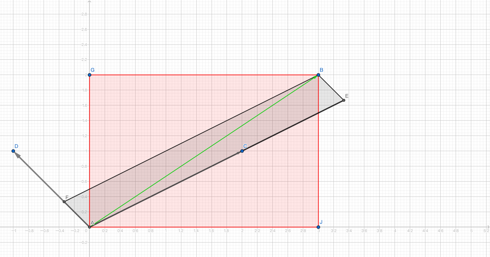

# Linear Transformations

```{r include=FALSE}
library(tidyverse)
library(knitr)
```


*Linear Transformation* is a function to manipulate the space. 

1. Input: a vector in a space; 

2. Function: a matrix as a 'function'; 

2. Output: a new vector in a new space. 

Linear transformation takes two steps: 

1. A linear combination of the basis vector--transform the basis into a new space; 

2. Map the original vector in the new space. 
A 2-D example: 

$$
\begin{bmatrix}
2 & -1 \\
1 & 1
\end{bmatrix} \times 
\begin{bmatrix}
1 & 0\\
0 & 1
\end{bmatrix} \times
\begin{bmatrix}
3 \\
2
\end{bmatrix}
$$


```{r echo=FALSE}

```

